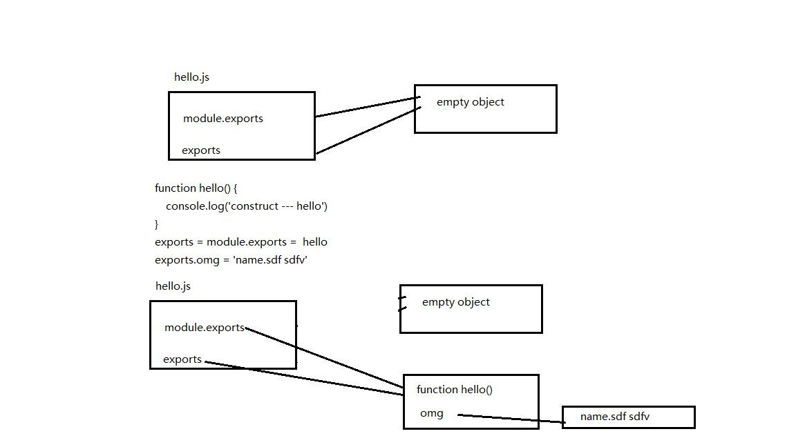

###exports 与 module.exports的区别

exports与module都是nodeJs的全局对象,exports 与 module.exports指向同一个内存地址

```
hello.js
    function hello() {
        console.log('hello')
    }
    exports.say = hello 

main.js
    const hello = require('./hello') 
    hello() //报错,因为hello是module.exports的引用,指向的是一个object,object不能直接调用
```

```
hello.js
    function hello() {
        console.log('hello')
    }
    exports.say = hello // 将hello方法暴露, 相当于 module.exports.say = hello

main.js
const hello = require('./hello') // 拿到hello.js 中 module.exports的引用
hello.say() //使用,  相当于 hello.js .module.exports.say()
```

```
hello.js

    function hello() {
        console.log('construct --- hello')
    }
    exports = module.exports =  hello 
    // module.exports = hello 对 mudole.exports 进行了覆盖，此时 module.exports 和 exports 的关系断裂，mudole.exports 指向了新的内存块，而exports 还是指向原来的内存块，为了让 module.exports 和 exports 还是指向同一个内存或者说指向同一个"对象"，所以我们就 exports = module.exports.
    exports.omg = 'name.sdf sdfv' 

main.js
    const Hello = require('./hello')

    let test = new Hello()
    console.log(Hello.omg)
    
```



###一般用法

- exports
  为模块外挂属性
  类似于Java中类的静态变量
- module.exports
  类似于Java中,将类public出去
  